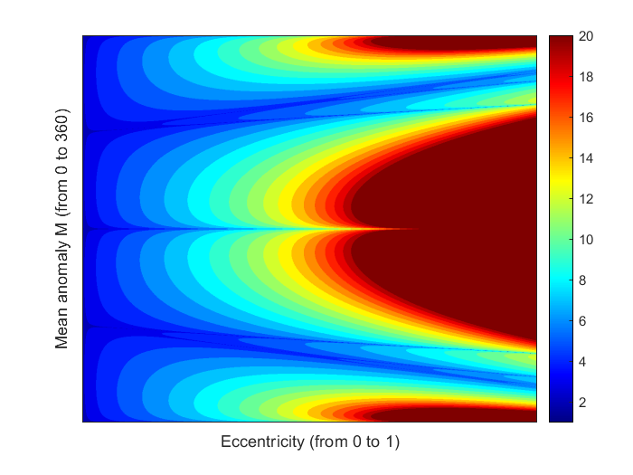
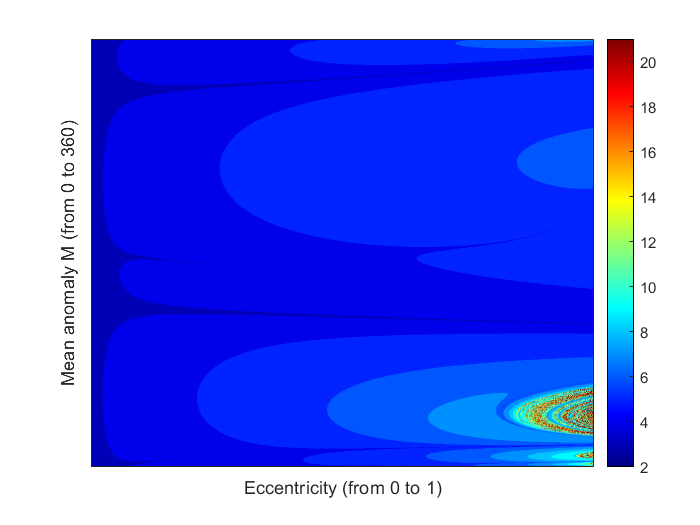

# kepler-solver
Small MATLAB program to solve the kepler's equation using Euler and Newton-Rapson methods.

## Code report 
---

This report is developed with the purpose of giving the lecturer a better understanding of the Keplers' equation resolution using different iterative methodologies. The body of the project briefly explains both Euler and Newton rapson methodologies and their equations. Finally an analysis of three different initial conditions is made for both methodologies and their computational cost.

---

The report can be found here in the following link:

<a href="/Kepler_s_Equation.pdf" download>Download report</a>

Some of the results you should get when runing the code are:

Please contact me to the following email if you find any mistake ar have any questions regarding the development:

<edgargc.upc@gmail.com>

